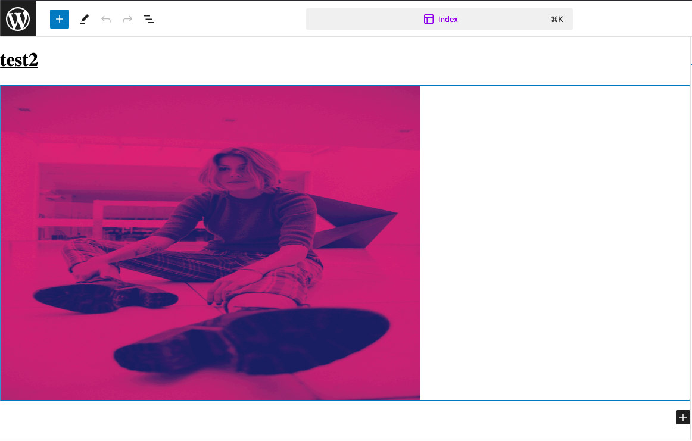
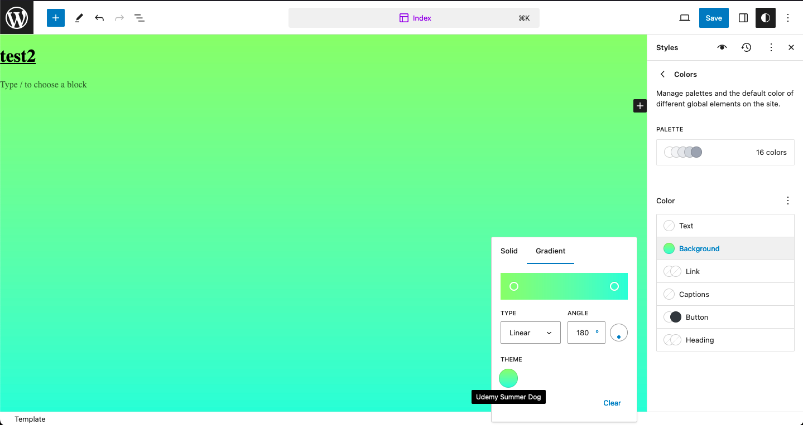
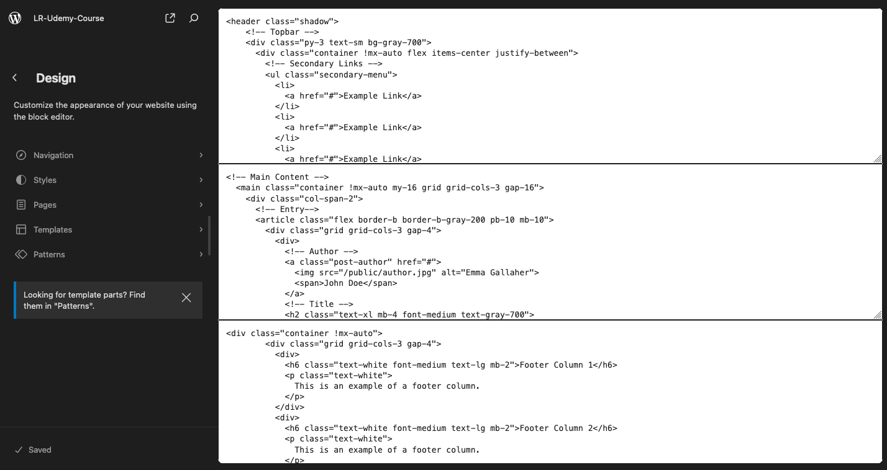
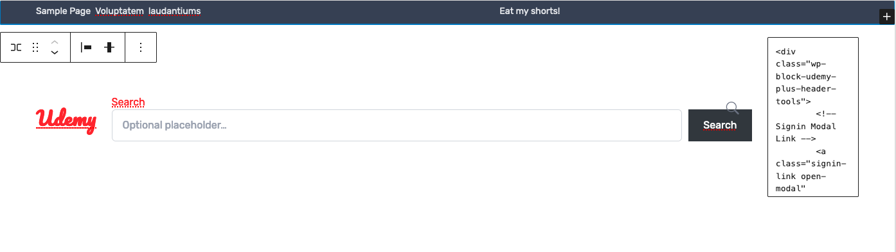

# Custom Wordpress Theme Development
### Author: Alexander Effanga

## Progress Log
### 10/19/2023
I've always been interested in the Wordpress ecosystem, but haven't made it past the typical drag-and-drop page builder plugins. Certain themes allow a degree of functionality, but even the most flexible of themes have their limitations. The goal here is to
learn the ropes of the Wordpress ecosystem, along with a decent amount of PHP and React, to create a theme that I'll eventually host live.

### 10/23/2023
I don't see myself using Duotones on Wordpress, but I feel like it's worth mentioning on here. Duotones for Wordpress is an experimental feture that allows the user to place a color-based filter on top of an image. The name stems from the fact that a user is required to enter two different colors, a darker color and lighter color, in order to create a dynamic color effect.

```
"settings": {
        "color": {
            "defaultPalette": false,
                "background": true,
                "text": true,
                "link": true,
                "custom": false,
                "duotone": [
                    {"slug": "u-pink-sunset", "colors": ["#11245e", "#dc4379"], "name": "pink-sunset"}
                ]
        }
}
```

 

 The gradients feature is pretty cool, and it utilizes css to detail the colors the user wishes to use. As expected, it is within the colro settings:

 ```
    "defaultGradients": false,
                "gradients": [
                    {"slug": "u-summer-dog", "name": "Udemy Summer Dog", "gradient": "linear-gradient(#a8ff78, #78ffd6)"}
                ]
 ``` 

 This will cause the screen to look as so: 



Anywhats, I'm learning more about the theme.json file and just how deep the cutomizations can go on this.

### 11/03/2023
Learned more on how to adjust global styles using theme.json
Not too much to say other than that. 

On another note, I'm now starting to learn about the world of hooks! Basically, hooks are functions that run during events.
It's basically Wordpress' answer to PHP's lack of a proper event-handling mechanism akin to Javascript's. It is by far the most
used API in the WP community. They're used to load both Javascript and css file. Where are hooks stored? The `functions.php` file, of course!
`functions.php` file is responsible for the logic of the theme, while `index.php` is responsible for displaying the content (that is if the `index.html` file isn't already in use). 

#### (Quick note as of 05/04/2024)
`index.php` is usually left blank sense WP FSE is primarily reliant on html-based block and Gutenberg's block grammar. As a result, it looks like this:

```
<?php

```

This is without a doubt, the most complex line of code I have ever written. Whatever is written in `index.php` will be displayed on the website, which is where templates come into play. 

### 11/04/2023
Learned some other functions, such as `add_actions()`, which passes a wordpress hook and the respective function it should call. Two types of files are compatible with `enqueue.php`: CSS and Javascript files. For future reference, it's generally advised to leave php mode when rendering html tags.

### 05/05/2024
Okay,
So it's been a while since I've updated this theme (rather, continued this course), but here we are. With no intention on stopping this time, let's continue.
Right now I'm working on recreating various template parts by further breaking them up into smaller pieces.



Right now, it's a bit fugly, at least in the way that it's set up.

#### Block vs Class Settings
When dealing with custom wordperss themes, using css classes is generally seen as faster and grants the decveloper full control of the elements. The only caveat is that it's harder to customize for clients.

Blocks on the otherhand are slower, but allow the clients to customize the theme much easier. The caveat to this is that no other properties are available due to the simplicity of Gutenberg's block designs.

Obviously, there are advantages and disadvanteges on using both, so it's realy up to the developer to decide which route to use.

### 05/06/2024
I spent the majority of the day trying to figure just how the css worked since their wasn't much explanation for the already-established css classes, such as the odd `!mx-auto` and the like. After doing some digging, it turns out that the theme is reliant primarily on tailwind css, but a precompiled, minified version of it. A lot of educaitonal content includes precompiled versions to simplify the process and reduce the need to go through the extra steps of setting up multiple configuration files.

Still not a big fan of the lack of explanation, but we can't have everything spoon fed to us, after all...

Besides that, I did add the css theme into the gutenberg editor by utilizing the WordPress hook, `after_setup_theme()`, which "is used to perform basic setup, registration, and init actions for a theme." ([from wp docs](https://developer.wordpress.org/reference/hooks/after_setup_theme/)). 
So I updated the `functions.php` file with the following:

```
include( get_theme_file_path('/includes/setup.php') );
add_action('after_setup_theme', 'u_setup_theme');
```

and created `setup.php` to include the following as well:

```
function u_setup_theme() {
    add_theme_support('editor-styles');
    add_editor_style([
        'https://fonts.googleapis.com/css2?family=Pacifico&family=Rubik:w
        'assets/bootstrap-icons/bootstrap-icons.css',
        'assets/public/index.css'
    ]);
}
```

The lines of code above allow me to see the two fonts – 'Pacifico' and 'Rubik', bootstrap icons, and the full `index.css` file (the precompiled tailwind file I referred to earlier).

Further along the lesson, I began to notice that the editor styles didn't match the front-end styles. For example:
#### Gutenberg Editor UI



#### Front-end Display


The reason being is due to the markup that wordpress generates for the front-end is different from the editor. The best way to fix that would be to manually input css specific styling for the section you want to match for the front-end, which can be a pain in the ass if one wants the all of the content made with the editor to match the front-end. So with that, I'll leave it be; tabs exist for a reason.


### 05/07/2024

I completed the header template by "transferring" the block code (manually copying from the gutenberg editor) into `header.html`.

So, the whole process involves hardcoding the html for the block parts, copying and pasting them onto the block editor (using the custom html block), recreate the block parts using the native gutneberg blocks (with the imported tailwind css), and finally replacing the original hard-coded html block parts with the copied block grammar/code from the visual editor.

I'm assuming the step involved were done for purely educational purposes. Hopefully we can go over custom block development in order to avoid going through such lengths.

#### The Query Loop Block
This project's first piece of dynamic content. The Query Loop Block grabs posts from the wp database and rendering them on a page with pagination. This block is the modern,updated version of what was once known as "The Loop".

When looking at the block, it's easy to assume that the query loop is doing all the work. In reality, the query loop grabs the data/content, but doesn't present it. It's child block, "Post Content" presents the data.

#### What is a Query?
A Query is a request for data from a database. Behind the scenes, WordPress will always perform a query on every page, posting data relating to the current url that it is on automatically.

#### Small issue on this part of the lesson.
As I went furhter along the lesson revolving around the query loop, the instructor used a block that shows the amount of comments a post has titled "Comments Count", which is a experimental feature that's only accessible through the Gutenberg plugin. That we have to download. For a course going over how to build custom themes and plugins from scratch.

A part of me wants to completely bypass this and find alternative to using this plugin (since I'm trying to use as few plugins as possible), but I can't let my ego/temperment get the better of me...ugh...

I went ahead and downloaded the plugin, and the visual editor looks a lot better! The block UI is a lot less clunky and, of course, the unseen blocks I was lamenting about finally appeared. Granted, said blocks are yet to be seen in the official release, and after doing some digging, "Comments Count" has been around since at least 2021.

All in all, I didn't get too much done today due to the massive amount of backtracking and off-tangent research regarding these 'mysterious' blocks.